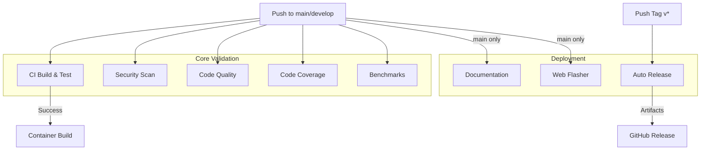

# OpenFIDO CI/CD Pipeline

This document describes the comprehensive Continuous Integration and Continuous Deployment (CI/CD) pipeline for OpenFIDO.

## 🚀 Pipeline Overview

The OpenFIDO pipeline is designed to ensure code quality, security, and reliability through automated testing, analysis, and deployment.



## 📋 Workflows

### 1. Core CI (`ci.yml`)
**Triggers:** Push/PR to `main`, `develop`
- **Multi-Compiler Build**: GCC and Clang validation
- **Unit Tests**: Runs CTest suite
- **Platform Builds**: Compiles firmware for ESP32, STM32, nRF52
- **Binary Size**: Tracks firmware size changes

### 2. Security Scanning (`security-scan.yml`)
**Triggers:** Push/PR to `main`, `develop`, Weekly Schedule
- **SAST**: CodeQL analysis for C/C++ vulnerabilities
- **Dependency Scan**: Trivy scan for vulnerable dependencies
- **Secret Detection**: Gitleaks scan for hardcoded secrets
- **License Check**: Compliance verification

### 3. Code Quality (`code-quality.yml`)
**Triggers:** Push/PR to `main`, `develop`
- **Static Analysis**: Cppcheck and Clang-Tidy
- **Complexity**: Lizard complexity analysis
- **Duplication**: PMD CPD duplicate code detection
- **SonarCloud**: Deep code analysis integration

### 4. Code Coverage (`coverage.yml`)
**Triggers:** Push/PR to `main`, `develop`
- **Measurement**: lcov/gcov line coverage
- **Reporting**: Uploads to Codecov
- **Visualization**: HTML reports and PR comments

### 5. Performance Benchmarks (`benchmarks.yml`)
**Triggers:** Push/PR to `main`, `develop`
- **Crypto**: ECDSA, SHA-256, AES performance
- **CBOR**: Encoding/decoding speed
- **Memory**: Stack and heap usage tracking
- **Regression Detection**: Fails on significant performance drops

### 6. Documentation (`docs.yml`)
**Triggers:** Push to `main`
- **Generation**: Doxygen from source comments
- **Deployment**: Auto-deploy to GitHub Pages
- **Versioning**: Tracks documentation with code


The pipeline is configured via several files in the repository:

| File | Purpose |
|------|---------|
| `.github/workflows/*.yml` | Workflow definitions |
| `.github/dependabot.yml` | Dependency update schedule |
| `.github/codeql/codeql-config.yml` | Security query configuration |
| `.clang-format` | Code formatting rules |
| `.clang-tidy` | Linting rules |
| `.sonarcloud.properties` | SonarCloud settings |
| `Doxyfile` | Documentation generation config |
| `Dockerfile` | Container environment definition |

## 📊 Badges

The `README.md` contains badges for the status of all major workflows:
- CI Status
- Security Scan Status
- Code Coverage %
- Code Quality Grade
- Documentation Build
- Docker Image Status

## 🔍 Local Testing

You can test workflows locally using [act](https://github.com/nektos/act):

```bash
# Test CI workflow
act push -W .github/workflows/ci.yml

# Test Security workflow
act push -W .github/workflows/security-scan.yml
```

## 📈 Monitoring

- **GitHub Actions**: View live logs and history
- **Codecov**: View detailed coverage maps
- **SonarCloud**: View quality gates and trends
- **GitHub Security**: View vulnerability alerts
